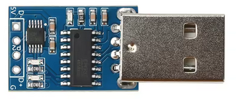

# CH9329 USB HID

This module adds USB HID support to devices that do not support this, usually this is non ESP32-S3 devices.

## Modules

### CH9329

**Default Baud Rate:** 9600

[Find on AliExpress](https://www.aliexpress.com/w/wholesale-CH9329.html)

{ width="200" }

### CH9329 Variant

[Find on AliExpress](https://www.aliexpress.com/w/wholesale-CH9329.html)

{ width="200" }

## Devices/Wiring Diagrams

### [M5Stack StickC - CH9329](../wiring-diagrams/m5stickc/ch9329.md)
