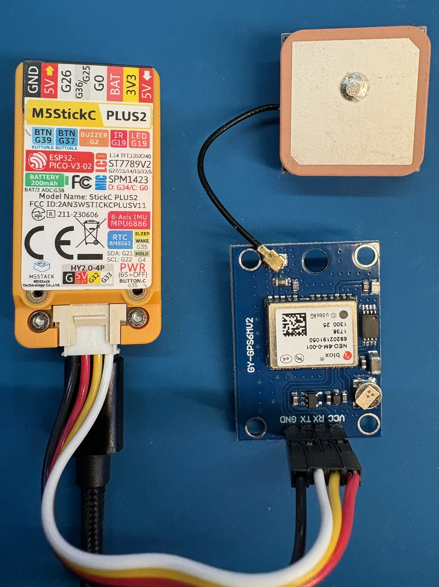
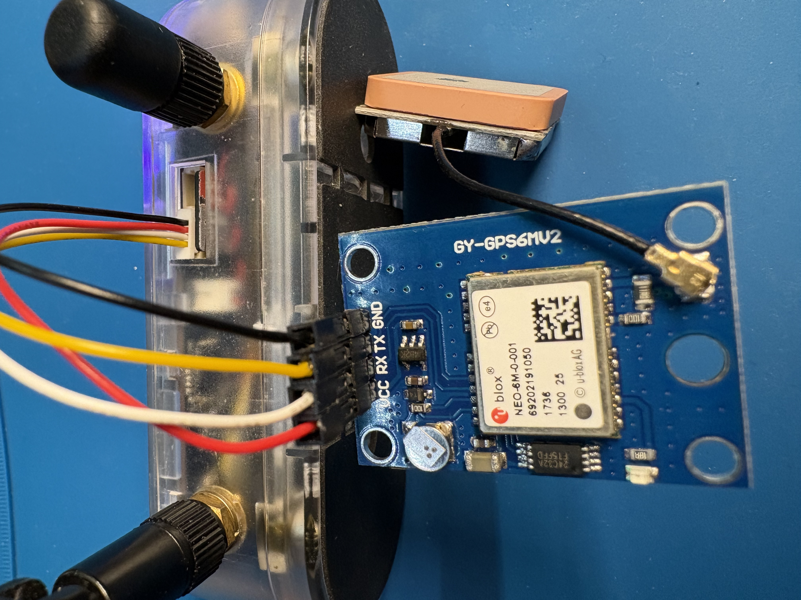
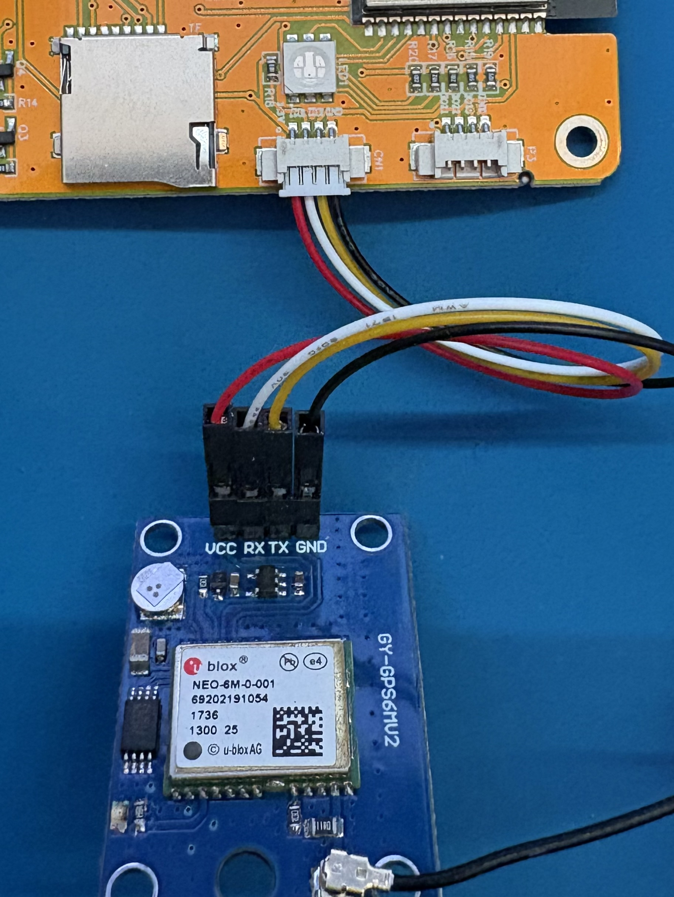

# GPS

Below is wiring information for popular devices and GPS modules.

## Configuration

You may need to change the [Baudrate](#baud-rate) and [GPS Pins](#gps-pins) configuration.

### Baud Rate

GPS -> Config -> Baudrate

* 9600
* 19200
* 38400
* 57600
* 115200

### GPS Pins

GPS -> Config -> GPS Pins

You can set the RX and TX pins away from their defaults if required.

## Modules

### NEO-6M

**Default Baud Rate:** 9600

[Find on AliExpress](https://www.aliexpress.com/w/wholesale-NEO-6M.html)

{ width="200" }

### ATGM336H

[Find on AliExpress](https://www.aliexpress.com/w/wholesale-ATGM336H.html)

**Default Baud Rate:** 9600

{ width="200" }

### M5Stack GPS Module

[Find on M5Stack Store](https://shop.m5stack.com/products/gps-bds-unit-v1-1-at6668)

**Default Baud Rate:** 9600

{ width="200" }

## Devices

### M5Stack StickC

**Default Pins:** RX=33 TX=32

{ width="300" }

### Cardputer

**Default Pins:** RX=1 TX=2

{ width="300" }

#### Cardputer Adv

**Default Pins:** RX=15 TX=13

{ width="300" }

**Alternative Pins:** RX=33 TX=32 follow wiring shown [here](#cardputer)

### Lilygo T-Embed CC1101

**Default Pins:** RX=44 TX=43

{ width="300" }

### CYD

**Default Pins:** RX=22 TX=27

{ width="300" }
