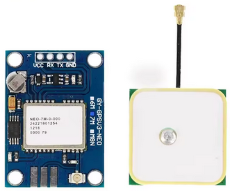
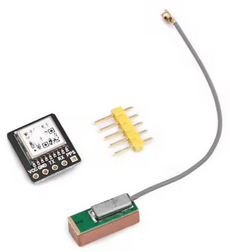
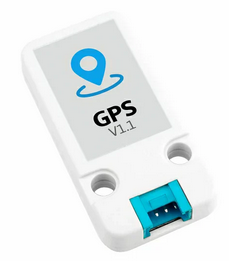

# GPS

Add GPS support to a device. This can be used for [Wardriving](../features/gps.md#wardriving) and [GPS Tracking](../features/gps.md#gps-tracker).

## Configuration

You may need to change the [Baudrate](#baud-rate) and [GPS Pins](#gps-pins) configuration depending on the GPS module and device you are using.

!!! info
    Since the GPS modules use UART/serial you need to ensure you swap the TX/RX pins when making the connections.
    `TX -> RX` and `RX -> TX`

### Baud Rate

GPS -> Config -> Baudrate

* 9600
* 19200
* 38400
* 57600
* 115200

### GPS Pins

GPS -> Config -> GPS Pins

You can set the RX and TX pins away from their defaults if required.

## Modules

### NEO-6M

**Default Baud Rate:** 9600

[Find on AliExpress](https://www.aliexpress.com/w/wholesale-NEO-6M.html)

{ width="200" }

### ATGM336H

[Find on AliExpress](https://www.aliexpress.com/w/wholesale-ATGM336H.html)

**Default Baud Rate:** 9600

{ width="200" }

### M5Stack GPS Module

[Find on M5Stack Store](https://shop.m5stack.com/products/gps-bds-unit-v1-1-at6668)

**Default Baud Rate:** 9600

{ width="200" }

## Devices/Wiring Diagrams

### [M5Stack StickC - GPS](../wiring-diagrams/m5stickc/gps.md)

### [M5Stack Cardputer - GPS](../wiring-diagrams/cardputer/gps.md)

### [M5Stack Cardputer Adv - GPS](../wiring-diagrams/cardputer/gps.md)

### [Lilygo T-Embed CC1101 - GPS](../wiring-diagrams/t-embed/gps.md)

### [CYD - GPS](../wiring-diagrams/cyd/gps.md)
