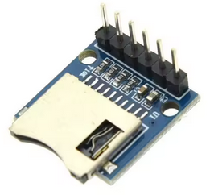

# SD Card Module

Used to add SD card support to devices that do not have a built in SD card reader.

## Modules

### SD Card Module

[Find on AliExpress](https://www.aliexpress.com/w/wholesale-SD-Card-Module.html)

{ width="200" }

## Devices/Wiring Diagrams

### [M5Stack StickC - SD Card](../wiring-diagrams/m5stickc/sd-card.md)

### [M5Stack StickC - SD Card and CC1101/NRF24](../wiring-diagrams/m5stickc/cc1101-nrf24.md)

### [M5StickS3 - SD Card](../wiring-diagrams/m5sticks3/sd-card.md)
