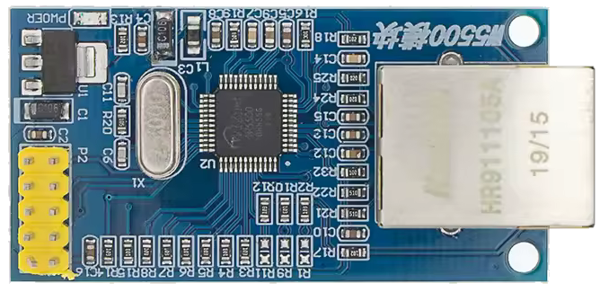

# W5500 Ethernet Module

Used to add Ethernet support to devices.

## Modules

### W5500

[Find on AliExpress](https://www.aliexpress.com/w/wholesale-W5500-Ethernet-Module.html)

{ width="200" }

{ width="200" }

## Devices/Wiring Diagrams

### [M5Stack StickC - W5500](../wiring-diagrams/m5stickc/w5500.md)

### [M5StickS3 - W5500](../wiring-diagrams/m5sticks3/w5500.md)

### [Cardputer - W5500](../wiring-diagrams/cardputer/w5500.md)

### [Cardputer Adv - W5500](../wiring-diagrams/cardputer-adv/w5500.md)

### [T-Embed - W5500](../wiring-diagrams/t-embed/w5500.md)

### [CYD - W5500](../wiring-diagrams/cyd/w5500.md)
