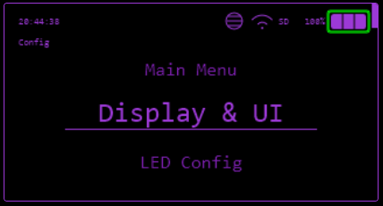

# Config

The config menu contains many settings, some relating to the device and some relating to features.

## Menu Items

### Display & UI

* **Brightness** - Adjust screen brightness
    * 100%
    * 75%
    * 50%
    * 25%
    * 1%
* **Dim Time** - Set time before screen dims
    * 10 seconds
    * 20 seconds
    * 30 seconds
    * 60 seconds
    * Disabled
* **Orientation** - Set screen orientation
    * Default
    * Landscape (180°)
    * Portrait (+90°)
    * Portrait (-90°)
* **UI Color** - Choose UI color
    * Range of build in colour schemes
    * Custom color - Choose custom [RGB565](https://rgbcolorpicker.com/565) values for:
        * Primary
        * Secondary
        * Background
    * Invert color
* **UI Theme** - Choose [theme](../customize-ui/themes.md)
    * **SD Card** - Load from SD Card
    * **LittleFS** - Load from LittleFS
    * **Default** - Restore default theme

### LED Config

* **LED Color** - Choose LED color
    * Range of build in colours
    * Custom color - Choose custom [RGB](https://rgbcolorpicker.com/) colour
* **LED Effect** - Choose LED effect
    * **Solid Color** - Constant on
    * **Breathe** - Smooth fade in and out
    * **Color Cycle** - Cycle through colors
    * **Color Wheel** - Rotate through color wheel
    * **Chase** - One LED chases around
    * **Chase Tail** - One LED with fading tail chases around
    * **Config - Speed** - Adjust speed of effect
        * 1 (slow) to 10 (fast)
        * Sync To Encoder - Movement of the encoder will animate the effect
    * **Config - Direction** - Set direction of effect
        * Clockwise
        * Anti-Clockwise
* **LED Brightness** - Adjust LED brightness
    * Off
    * 10%
    * 25%
    * 50%
    * 75%
    * 100%
* **LED Blink On/Off** - Toggle LED blinking for some notifications

### Audio Config

* **Sound On/Off** - Toggle sound
* **Volume** - Adjust volume level

### System Config

* **InstaBoot On/Off** - Toggles instant bootup, skipping the splash screen and start up sound
* **WiFi Startup On/Off** - Toggles automatic WiFi connection on startup to a known network if credentials are saved
* **Startup App** - Choose an app to launch on startup from:
    * None
    * Brucegotchi
    * Clock
    * Custom SubGHz
    * GPS Tracker
    * JS Interpreter
    * Mass Storage
    * PN532 BLE
    * PN532 UART
    * Sniffer
    * Wardriving
    * WebUI
* **Hide/Show Apps** - Choose which apps to show in the main menu
* **Clock** - Set system clock
    * **Via NTP Set Timezone** - Select timezone for NTP time sync which happens when connected to WiFi
    * **Set Time Manually** - Set date and time manually
    * **Daylight Savings On/Off** - Toggle daylight savings time
    * **12/24 Hour Format** - Choose between 12 hour (AM/PM) or 24 hour time format
* **Advanced** - Opens advanced configuration options:
    * **Toggle BLE API** - Toggle on BLE API
    * **Network creds** - Configure AP Mode SSID and Password
        * WiFi AP Creds
            * SSID
            * Password
    * **BadUSB/BLE** - Configure BadUSB/BLE settings
        * **Keyboard Layout** - Select keyboard layout
        * **Key Delay** - Set delay between keystrokes (in ms)
        * **Show Output** - Toggle showing output withint the BadUSB/BLE app
    * **Factory Reset** - Reset device to factory settings (all configuration data will be reset).

### Power

This menu contains power-related options:

* **Deep Sleep** - Put the device into deep sleep mode to conserve battery.
* **Sleep** - Put the device into sleep mode.
* **Restart** - Restart the device.
* **Power Off** - Turn off the device.

### Install App Store

If the App Store is not installed, this option will allow you to install it, you must be connected to WiFi for this to work.

Once intalled you can find the App Store by going to `JS Interpreter -> Tools`.

### Dev Mode

This is a special menu for developers and advanced users. It contains options to configure hardware interfaces and switch serial modes.

!!! info
    To activate Dev Mode scroll through the main menu 5 times.

* **I2C Finder** - Scan and display connected I2C device addresses
* **CC1101 Pins** - Display/edit CC1101 module pin configuration
* **NRF24 Pins** - Display/edit NRF24 module pin configuration
* **LoRa Pins** - Display/edit LoRa module pin configuration
* **W5500 Pins** - Display/edit W5500 Ethernet module pin configuration
* **SD Card Pins** - Display/edit SD Card module pin configuration
* **I2C Pins** - Display/edit I2C bus pin configuration
* **UART Pins** - Display/edit UART pin configuration
* **GPS Pins** - Display/edit GPS module pin configuration
* **Serial USB** - Switch to Serial over USB
* **Serial UART** - Switch to Serial over UART
* **Disable DevMode** - Disable Dev Mode and hide this menu

### About

Displays information about the device, including:

* Firmware Version
* Memory
* Network
* Storage
* Screen
* GPIO
* Battery
