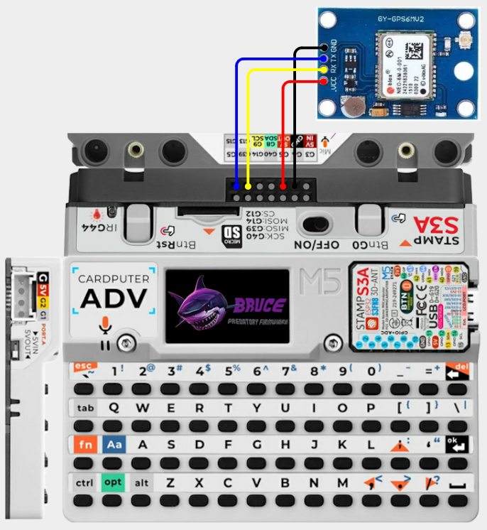
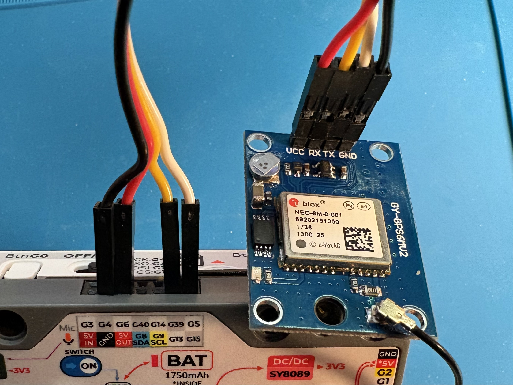

# Cardputer Adv - GPS

## Configuration 

More information GPS modules can be found [here](../../external-modules/gps.md).

**Default Pins:** RX=15 TX=13

**Alternative Pins:** RX=33 TX=32 follow wiring shown [here](../cardputer/gps.md#wiring-diagram)

## Items Needed

* [GPS Module](../../external-modules/gps.md#modules)

## Pins

| GPS | Cardputer Adv |
| -: | - |
| VCC/5V - 1 | 5V |
| RX - 2 | G13 |
| TX - 3 | G15 |
| GND - 4 | GND |

## Wiring Diagram

This shows wiring for the [default pins](#configuration) you can wire up using the [alternative pins](#configuration) using the [Cardputer](../cardputer/gps.md#wiring-diagram) diagram.

[View on Cirkit Designer](https://app.cirkitdesigner.com/project/bb5fd016-9079-4cb4-a977-b6764aa94f67)

{ width="400" }

{ width="400" }
