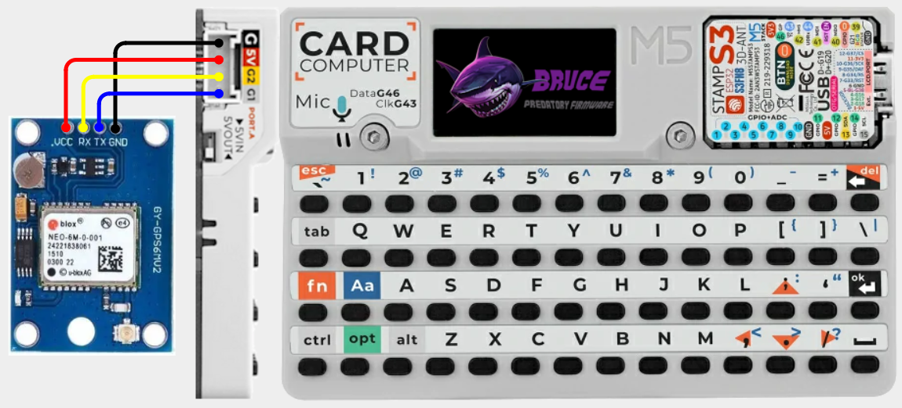

# Cardputer - GPS

## Configuration 

More information GPS modules can be found [here](../../external-modules/gps.md).

**Default Pins:** RX=1 TX=2

## Items Needed

* [GPS Module](../../external-modules/gps.md#modules)

## Pins

| GPS | Cardputer |
| -: | - |
| VCC/5V - 1 | 5V |
| RX - 2 | G2 |
| TX - 3 | G1 |
| GND - 4 | GND |

## Wiring Diagram

[View on Cirkit Designer](https://app.cirkitdesigner.com/project/70897d29-5d8f-46f0-995e-28ccf1f0e660)

{ width="400" }

{ width="400" }
