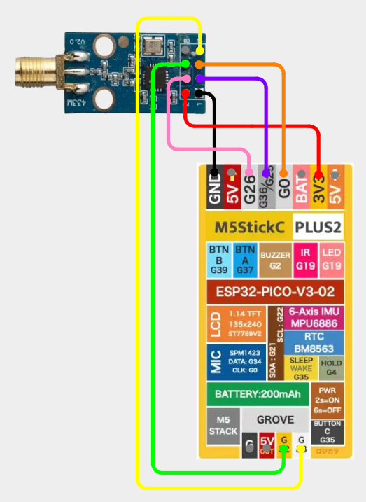

# M5StickC - CC1101/NRF24

## Items Needed

* [CC1101](../../external-modules/cc1101.md#modules)
* [NRF24](../../external-modules/nrf24.md#modules)

## Shared SPI

!!! info
    Please ensure you select Shared SPI

    **CC1101:** `RF -> Config -> RF Module -> CC1101 (Shared SPI)`

    **NRF24:** `NRF24 -> Config Pins -> NRF24 (Shared SPI)`

### Pins

| CC1101/NRF | M5StickC |
| -: | - |
| GND - 1 | GND |
| VCC - 2 | 3V3 |
| GDO0 - 3 | G32 |
| CSN - 4 | G33 |
| SCK - 5 | G0 |
| MOSI - 6 | G26 |
| MISO/GDO1 - 7 | G36/G25 |
| DGO2 - 8 | Not Connected |

### Wiring Diagram

The diagram shows a CC1101, the wiring is the same for an NRF24.

[View on Cirkit Designer](https://app.cirkitdesigner.com/project/27d869ec-fe6b-433d-9994-5d58fa3c5da3)

{ width="400" }

## Legacy SPI

!!! info
    Please ensure you select Legacy SPI

    **CC1101:** `RF -> Config -> RF Module -> CC1101 (Legacy SPI)`

    **NRF24:** `NRF24 -> Config Pins -> NRF24 (Legacy SPI)`

### Pins

| CC1101/NRF | M5StickC |
| -: | - |
| GND - 1 | GND |
| VCC - 2 | 3V3 |
| GDO0 - 3 | G36/G25 |
| CSN - 4 | G26 |
| SCK - 5 | G0 |
| MOSI - 6 | G32 |
| MISO/GDO1 - 7 | G33 |
| DGO2 - 8 | Not Connected |

### Wiring Diagram

The diagram shows a CC1101, the wiring is the same for an NRF24.

[View on Cirkit Designer](https://app.cirkitdesigner.com/project/1783b122-cb5d-41d4-96aa-12769733b86f)

{ width="400" }
