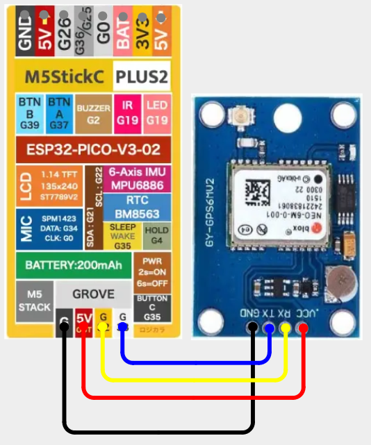

# M5StickC - GPS

## Configuration 

More information GPS modules can be found [here](../../external-modules/gps.md).

**Default Pins:** RX=33 TX=32

## Items Needed

* [GPS Module](../../external-modules/gps.md#modules)

## Wiring Diagram

[View on Cirkit Designer](https://app.cirkitdesigner.com/project/02059b54-0813-4747-a074-ce20b39c8701)

{ width="400" }

{ width="400" }
