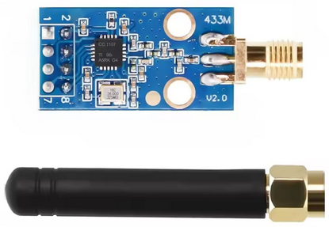
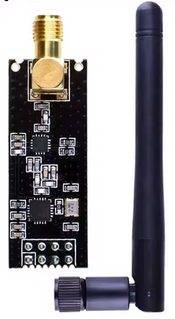
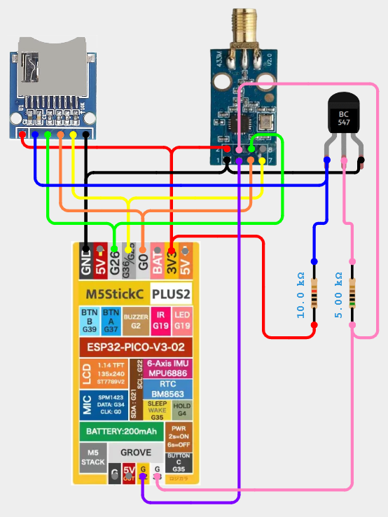

# M5StickC - SD Card and CC1101/NRF24

## Items Needed

### SD Card Module

[Find on AliExpress](https://www.aliexpress.com/w/wholesale-SD-Card-Module.html)

{ width="200" }

### BC547 Transistor

[Find on AliExpress](https://www.aliexpress.com/w/wholesale-BC547.html)

### Resistors

* 1x 10k
* 1x 5k

[Find on AliExpress](https://www.aliexpress.com/w/wholesale-Resistors.html)

### CC1101

[Find on AliExpress](https://www.aliexpress.com/w/wholesale-CC1101.html)

{ width="200" }

### NRF24

[Find on AliExpress](https://www.aliexpress.com/w/wholesale-NRF24.html)

{ width="200" }

## Wiring Diagram

!!! info

    This setup needs a change to the configuration to work:

    `RF -> Config -> CC1101 (Shared SPI)`

The diagram shows a CC1101, the wiring is the same for an NRF24.

[View on Cirkit Designer](https://app.cirkitdesigner.com/project/b5f4d910-647c-4dd4-b1b1-efeff06263fa)

{ width="400" }
