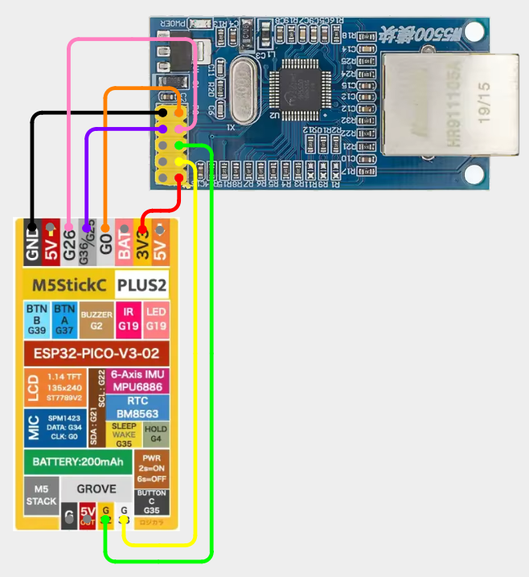
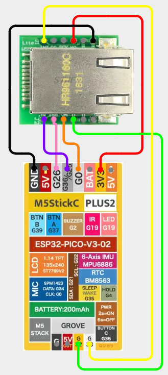

# M5StickC - W5500 Ethernet

## Items Needed

* [W5500 Ethernet Module](../../external-modules/w5500-ethernet-module.md#modules)

## W5500

### Pins

| W5500 | M5StickC |
| -: | - |
| GND - 1 | GND |
| SCLK - 2 | G0 |
| INT - 3 | G36/G25 |
| SCS - 4 | G26 |
| RST - 5 | Not Connected |
| MOSI - 6 | G32 |
| GND - 7 | Not Connected |
| MISO - 8 | G33 |
| 5V - 9 | Not Connected |
| 3V3 - 10 | 3V3 |

### Wiring Diagram

[View on Cirkit Designer](https://app.cirkitdesigner.com/project/205439f1-faaf-44a0-bb5d-d4c12b5d9a3e)

{ width="400" }

## W5500 - Mini

### Pins

| W5500 | M5StickC |
| -: | - |
| GND - 1 | GND |
| 3V3 - 2 | 3V3 |
| 3V3 - 3 | Not Connected |
| NC - 4 | Not Connected |
| RST - 5 | Not Connected |
| MISO - 6 | G33 |
| INT - 7 | G36/G25 |
| CS - 8 | G26 |
| SCLK - 9 | G0 |
| MOSI - 10 | G32 |
| GND - 11 | GND |
| GND - 12 | GND |

### Wiring Diagram

[View on Cirkit Designer](https://app.cirkitdesigner.com/project/6b4f30ba-e888-4d1f-a82c-44037d5ae6f4)

{ width="400" }
