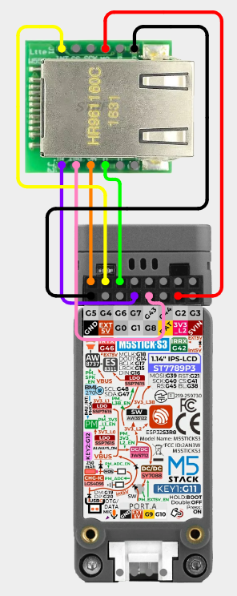

# M5StickS3 - W5500 Ethernet

## Items Needed

* [W5500 Ethernet Module](../../external-modules/w5500-ethernet-module.md#modules)

## W5500

### Pins

!!! info
    In Bruce 1.14+ you will need to set the pins for CS and INT (CE/GDO0) in the [Dev Mode](../../features/config.md#dev-mode) menu.

| W5500 | M5StickS3 |
| -: | - |
| GND - 1 | GND |
| SCLK - 2 | G5 |
| INT - 3 | G1 |
| SCS - 4 | G8 |
| RST - 5 | Not Connected |
| MOSI - 6 | G6 |
| GND - 7 | Not Connected |
| MISO - 8 | G4 |
| 5V - 9 | Not Connected |
| 3V3 - 10 | 3V3 |

### Wiring Diagram

[View on Cirkit Designer](https://app.cirkitdesigner.com/project/da1b9123-c9d3-47ec-bb02-e3d66c83e899)

{ width="400" }

## W5500 - Mini

### Pins

!!! info
    In Bruce 1.14+ you will need to set the pins for CS and INT (CE/GDO0) in the [Dev Mode](../../features/config.md#dev-mode) menu.

| W5500 | M5StickS3 |
| -: | - |
| GND - 1 | GND |
| 3V3 - 2 | 3V3 |
| 3V3 - 3 | Not Connected |
| NC - 4 | Not Connected |
| RST - 5 | Not Connected |
| MISO - 6 | G4 |
| INT - 7 | G1 |
| CS - 8 | G8 |
| SCLK - 9 | G5 |
| MOSI - 10 | G6 |
| GND - 11 | GND |
| GND - 12 | GND |

### Wiring Diagram

[View on Cirkit Designer](https://app.cirkitdesigner.com/project/9dc1f2de-8f5a-41fe-a011-cde07664405f)

{ width="400" }
