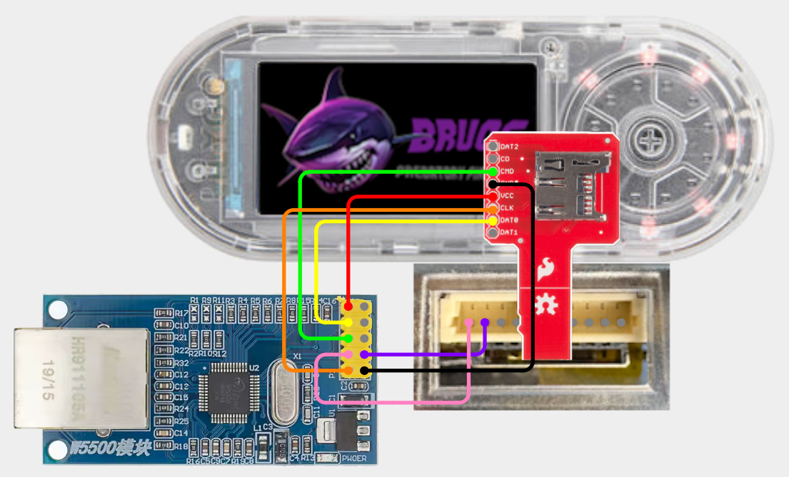

# T-Embed - W5500 Ethernet

## Items Needed

* [W5500 Ethernet Module](../../external-modules/w5500-ethernet-module.md#modules)
* [Micro SD Sniffer](../../external-modules/micro-sd-sniffer.md#modules)
  
## W5500

### Pins

| W5500 | T-Embed |
| -: | - |
| GND - 1 | GND (on SD Sniffer) |
| SCLK - 2 | CLK (on SD Sniffer) |
| INT - 3 | 43 |
| SCS - 4 | 44 |
| RST - 5 | Not Connected |
| MOSI - 6 | CMD (on SD Sniffer) |
| GND - 7 | Not Connected |
| MISO - 8 | DAT0 (on SD Sniffer) |
| 5V - 9 | Not Connected |
| 3V3 - 10 | VCC (on SD Sniffer) |

### Wiring Diagram

[View on Cirkit Designer](https://app.cirkitdesigner.com/project/f5c28967-8090-4c9b-8cd9-938d30e28c48)

{ width="400" }

## W5500 - Mini

### Pins

| W5500 | T-Embed |
| -: | - |
| GND - 1 | GND (on SD Sniffer) |
| 3V3 - 2 | VCC (on SD Sniffer) |
| 3V3 - 3 | Not Connected |
| NC - 4 | Not Connected |
| RST - 5 | Not Connected |
| MISO - 6 | DAT0 (on SD Sniffer) |
| INT - 7 | 43 |
| CS - 8 | 44 |
| SCLK - 9 | CLK (on SD Sniffer) |
| MOSI - 10 | CMD (on SD Sniffer) |
| GND - 11 | GND |
| GND - 12 | GND |

### Wiring Diagram

[View on Cirkit Designer](https://app.cirkitdesigner.com/project/a18ffa3e-0108-42ed-9002-77cd95165765)

{ width="400" }
